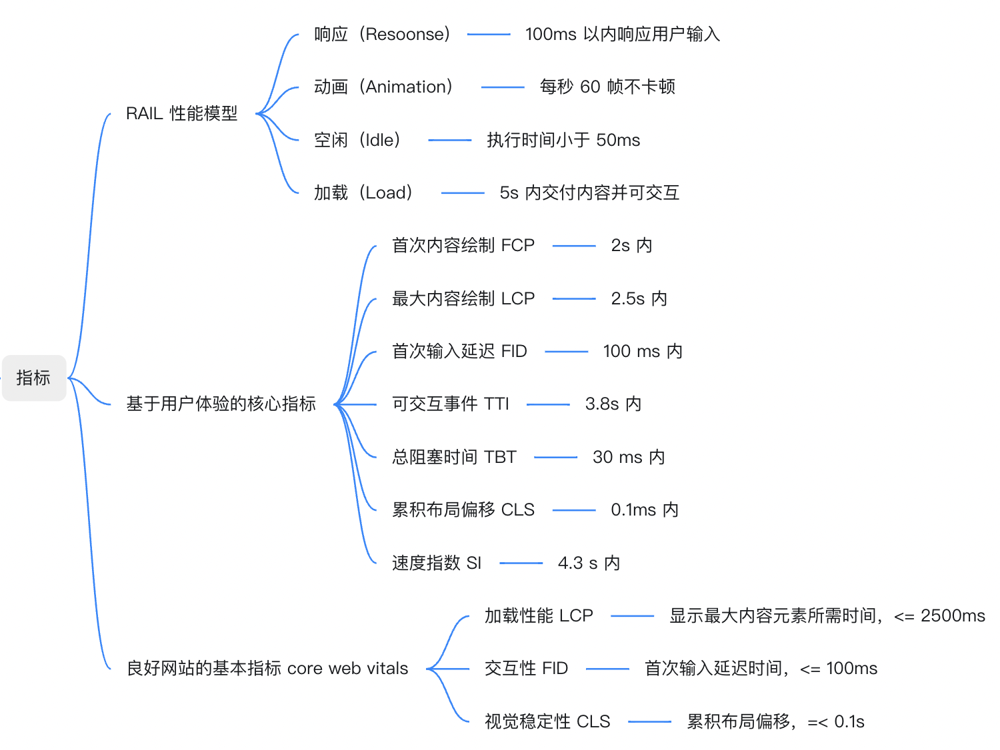
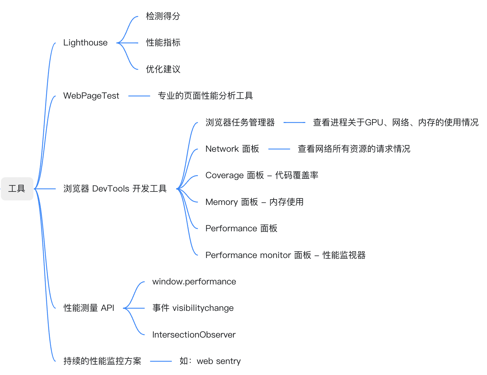
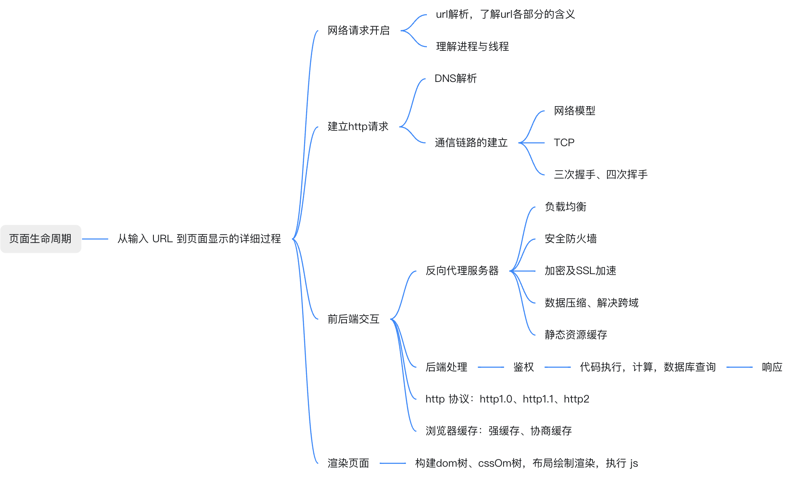
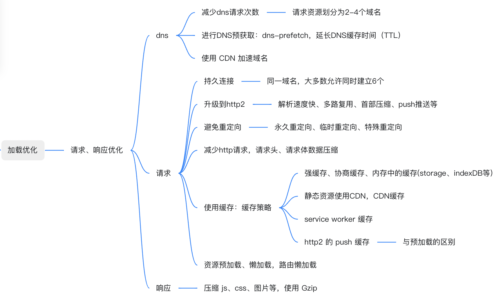
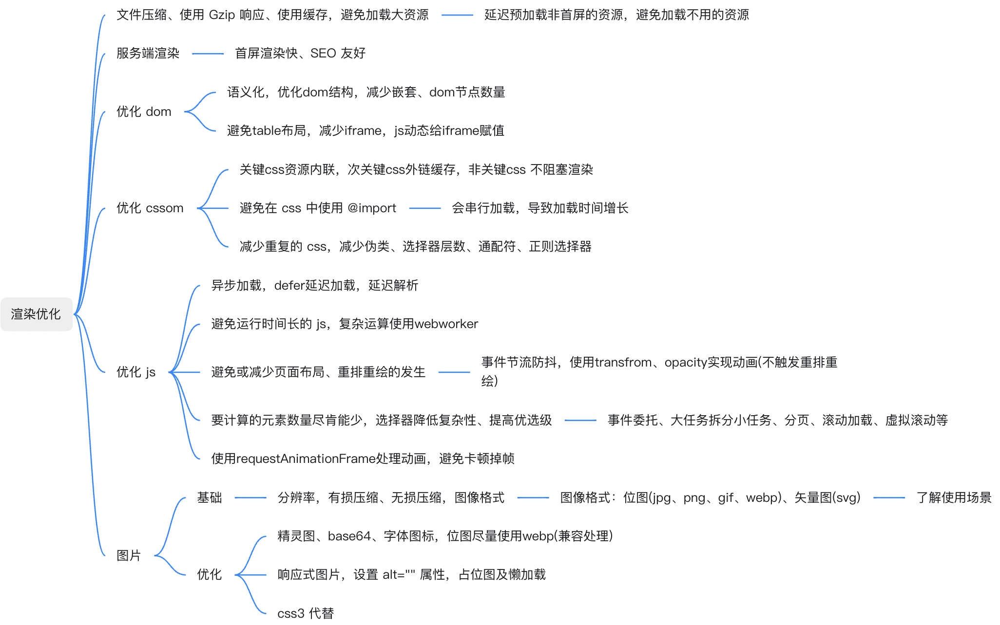
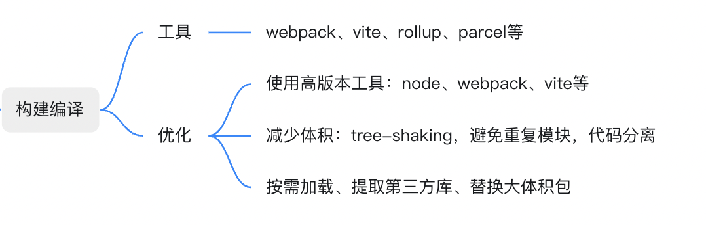
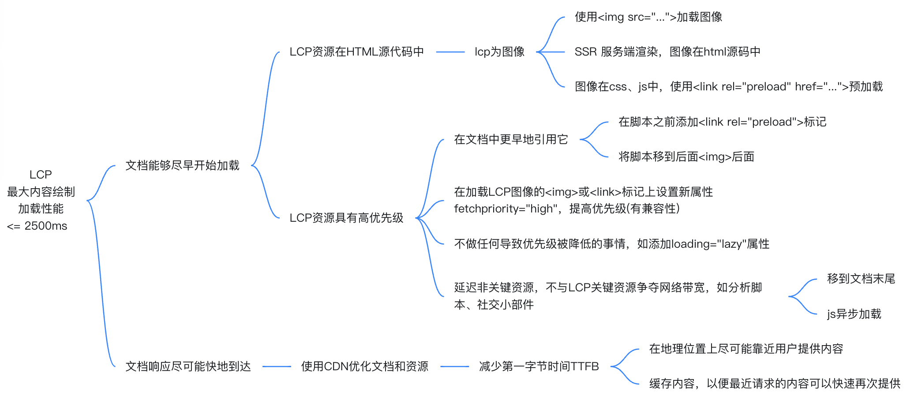
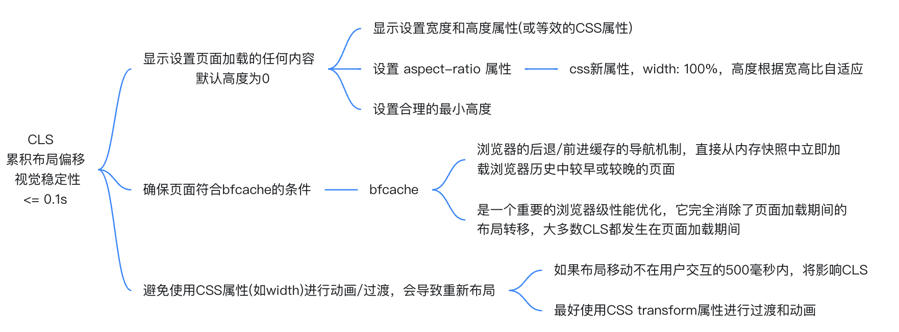
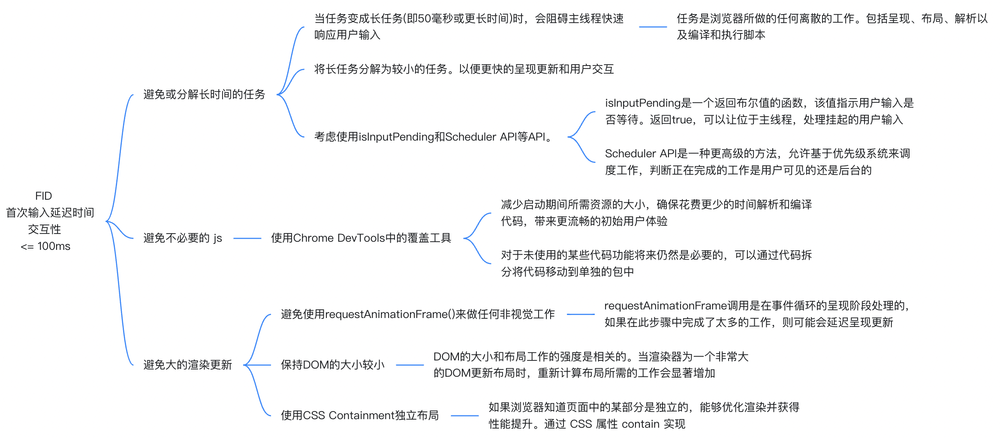

# 性能优化地图
## 1、何为性能？
Web 性能指页面加载到可交互和可响应所消耗的时间，以及页面在交互时的流畅度——滚动是否顺滑？按钮能否点击？弹窗能否快速打开，动画是否平滑？

Web 性能既包括客观的度量如加载时间，每秒帧数和到页面可交互的时间；也包括用户的对页面内容加载时间的主观感觉。

页面响应时间越长，越多的用户就会放弃该网站。
## 2、为何要优化
性能是留住用户的关键
高性能网站比低性能网站更能吸引和留住用户。

性能意味着提高转化率
留住用户对于提高转化率至关重要。慢速网站对收入有负面影响，而快速网站显示可以提高转化率。

性能关乎用户体验
在用户体验方面，速度至关重要。性能是良好用户体验的基础。

### 4、可用工具

### 5、页面生命周期

### 6、性能优化 - 基于页面生命周期

这儿基于页面生命周期过程进行优化，也可以根据各项性能指标进行优化。

#### 6.1、加载优化

#### 6.2、渲染优化

#### 6.3、构建编译优化

### 7、性能优化 - 基于核心指标 core web vitals
#### 7.1、优化最大内容绘制LCP

#### 7.2、优化累积布局偏移CLS

#### 7.3、优化首次输入延迟FID
